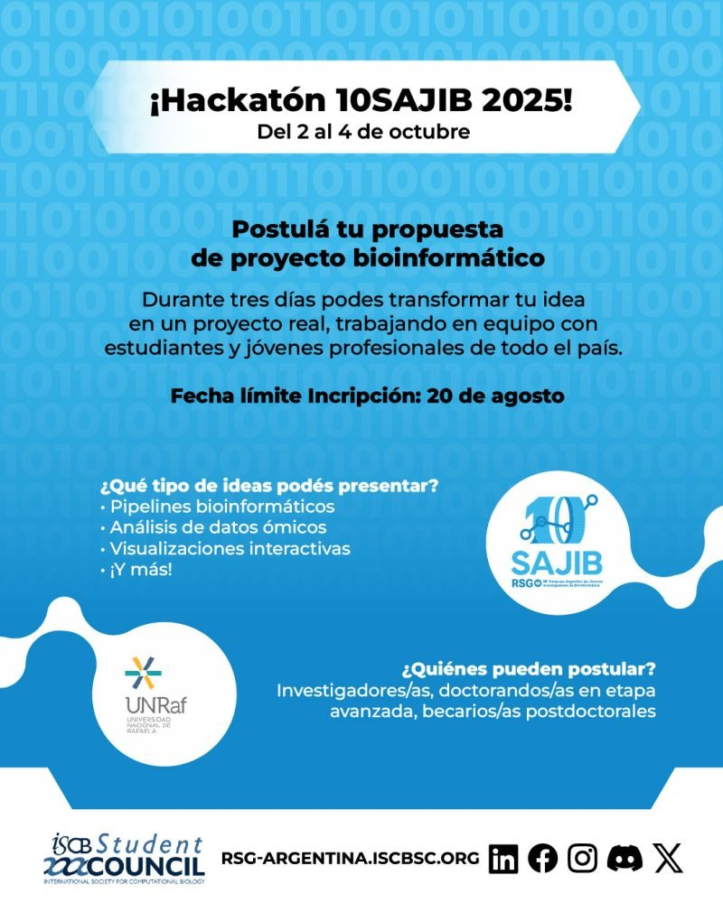

### :red_circle: 10SAJIB :computer:

El lenguaje oficial de la 10SAJIB es el Español
- Patrocinadores y colaboradores: [ISCB-SC](https://iscbsc.org/)

---
### Fechas importantes :computer:

#### Apertura de inscripciones (28/04)

📝[Formulario de inscripción](https://forms.gle/zv5YsA5SvposfCmn6)

#### Envío de resúmenes (01/07 al ~~31/07~~ 25/08) (📢 *plazo extendido*)

📝[Formulario de envío](https://forms.gle/sE5U5ZLqH5D8AYbS9)

#### Comunicación de resultados (01/09)

#### Día 1: Talleres (9/10)

#### Día 2: Simposio (10/10)

---
### Transporte

🚌 Para facilitar la movilidad contaremos con un transporte ida y vuelta desde **CABA** y **Rosario** 
- Salida el 09/10 (llegando a tiempo para los talleres)
- Regreso el 10/10 .

💰 El transporte estará disponible para la comunidad y cada persona deberá cubrir el costo de su pasaje.

🎓 **Además, ¡podés solicitar becas de transporte!**

🔗 [Formulario de inscripción al transporte](https://docs.google.com/forms/d/e/1FAIpQLSdFaYxYHNVvfUHqejfZkcETYw6A-fiiXJAP_YYAEiHQkRMVQQ/viewform?usp=send_form)

---

### 🧩 Hackatón

📣 **¡Postulá tu propuesta antes del miércoles 20 de agosto!**

Del 2 al 4 de octubre se llevará a cabo una experiencia única. Buscamos proyectos bionformáticos concretos, creativos y colaborativos , que puedan ser desarrollados en solo 2 días junto a estudiantes y jóvenes profesionales de todo el país.

🧬 **¿Qué tipo de ideas podés presentar?**
* Pipelines bioinformáticos
* Análisis de datos ómicos
* Visualizaciones interactivas
* ¡Y mucho más!

👩💻 **¿Quiénes pueden postular?**

Investigadores/as, doctorandos/as en etapa avanzada, becarios/as postdoctorales... Si tenés una idea clara, ganas de liderar un equipo y compartir conocimiento, ¡está convocatoria es para vos!.

📝 [Formulario](https://docs.google.com/forms/d/e/1FAIpQLSdrrb0-ZbE9l4ibtFVHSxSouOwA7N6dPUrqYpBjH2HF-_D68A/viewform)

  

---
### Temas de simposio
- Ómicas
- Ecología y Evolución
- Bioinformática estructural
- Bioinformática en industria
- Aplicaciones de Inteligencia Artificial
- Desarrollo de algoritmos y herramientas
- Bioinformática clínica y traslacional
- Educación y extensión 
- Modelado y simulación de sistemas biológicos
- Quimioinformática
- Ciencia de datos

---
### Certificados
- Certificados de asistencia a los talleres
- Certificado de participación en el 10SAJIB

---
### Código de conducta
Además de la inscripción y la asistencia, la participación en este evento requiere la aceptación del siguiente [Código de conducta](https://docs.google.com/document/d/1gmpcx05KAHsSO6MHd4ettlGT5cy7b9Yp4D55CZoN9RA/edit?usp=sharing).

---

## Redes sociales
- [Twitter](https://twitter.com/rsgargentina)
- [Linkedin](https://www.linkedin.com/in/iscb-sc-rsg-argentina-053599214/)
- [Instagram](https://www.instagram.com/rsg_arg/)
- [Facebook](https://www.facebook.com/RSGArgentina/)
- [Youtube](https://www.youtube.com/channel/UCVQA_t8dR5xownEu5NI9S0w/featured)